# Unreal Engine 4 - How to create custom Pins

This repo is a simple guide about **how to create custom Pins** in the **Unreal Engine 4 editor**.

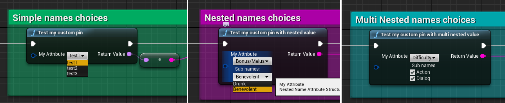

This implementation has been inspired from the detailed post:  
[https://wiki.unrealengine.com/How_To_Create_Custom_Blueprint_Pin](https://wiki.unrealengine.com/How_To_Create_Custom_Blueprint_Pin).

> /!\ When this repository has been created, the UE wiki has been removed from the Epic staff due to security problems.  
> Nonetheless they gave access of an archive with all the wiki contents.  
> Inside you can find the same article in the following path:  
> `WikiPages/Unreal%20Engine%20Wiki/mediawikiv2-website-prod05.ol.epicgames.net/index0275.html`

## Tables

-   [Introduction](#title1)
    -   [Goals](#title1-1)
    -   [Repo contents](#title1-2)
-   [Make it work: step by step guide](#title2)
    -   [1 - open blueprint level](#title2-1)
    -   [2 - locate the blueprint node](#title2-2)
    -   [3 - open project settings](#title2-3)
    -   [4 - open custom settings](#title2-4)
    -   [5 - add new config name](#title2-5)
    -   [6 - compile](#title2-6)
    -   [7 - choose a config name in the blueprint](#title2-7)
    -   [8 - save and play](#title2-8)
    -   [9 - see your choosen config printed](#title2-9)
-   [Implementation notes](#title3)
    -   [UE4HowtoCustomPin.uproject](#title3-1)
    -   [Main `Source` directory](#title3-2)
    -   [`CustomPin` Plugin](#title3-3)
-   [Next](#title4)

## Introduction

[^ tables](#tables)

### Goals

[^ tables](#tables)

It's a simple repository to show you how to:

-   **create new pins** for nodes in the editor graph
-   make it work associated to **custom settings** data

### Repo contents

[^ tables](#tables)

This project is composed of:

-   a simple UE4 **c++ blank project** ready to build and start
-   a custom plugin to give also an example of plugin management, in it you will find:
    -   custom **pins** classes
    -   a **factory** to register these pins to the editor graph
    -   custom **structs** which can be used as any UPROPERTY or UFUNCTION parameters to display our new pins in blueprint nodes
    -   a custom **config** object used to create new possibilities to our pins choices (configuration located in UE4 `project settings`)

## Make it work: step by step guide

[^ tables](#tables)

### 1 - Open blueprint level

[^ tables](#tables)

Example is located in the blueprint level, so open it:

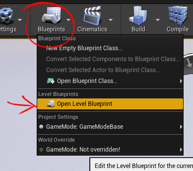

### 2 - Locate blueprint nodes

[^ tables](#tables)

Choices are empty for now, don't panic, some are coming soon!

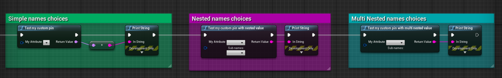

### 3 - Open project settings

[^ tables](#tables)

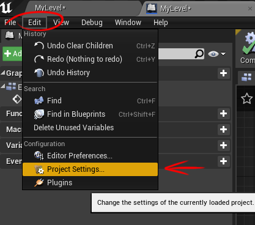

### 4 - Open custom settings

[^ tables](#tables)

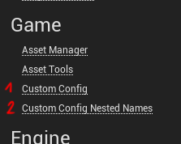

### 5 - Add new config names

[^ tables](#tables)

#### 5a - Simple config name

[^ tables](#tables)

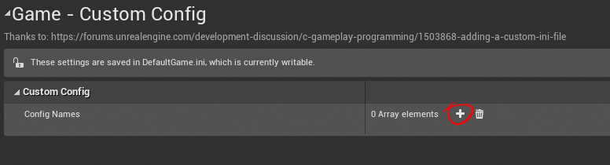
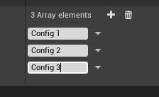

#### 5b - Nested config name

[^ tables](#tables)

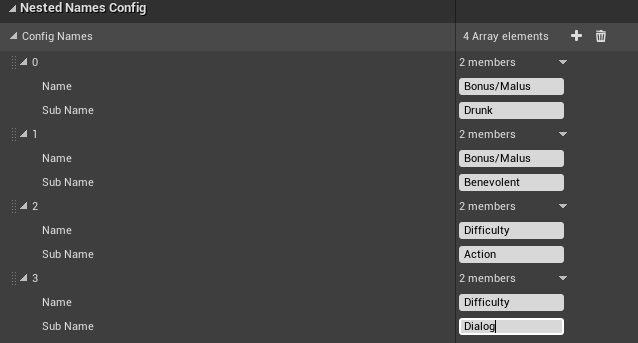

### 6 - Compile

[^ tables](#tables)

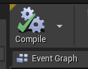

### 7 - Change nodes in the blueprint

[^ tables](#tables)

### 8 - Save and play

[^ tables](#tables)

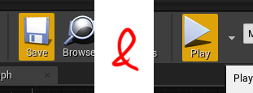

### 9 - See your choosen config printed

[^ tables](#tables)

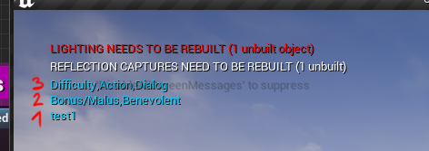

## Implementation notes

[^ tables](#tables)

You should take a look at each classes to see implementations details, but before just a quick glance of what it is composed of:

### [UE4HowtoCustomPin.uproject](./UE4HowtoCustomPin.uproject)

[^ tables](#tables)

Not really interesting, just look at the `"plugins"` section which import the main plugin.

### Main `Source` directory

[^ tables](#tables)

Except the [`UE4HowtoCustomPin.Build.cs`](./Source/UE4HowtoCustomPin/UE4HowtoCustomPin.Build.cs) file to see dependencies, it's not worth it. I didn't do anything in it, it's all default content created with Unreal Engine boilerplate.

### `CustomPin` Plugin

[^ tables](#tables)

All the job is done here!  
You can look at the [`CustomPin.Build.cs`](./Plugins/CustomPin/Source/CustomPin/CustomPin.Build.cs) to see dependencies.  
A quick preview of each classes:

| Class                            | files                                                                                                                                                                                                 | Purpose                                                                                                                                                                                                                                                       |
| -------------------------------- | ----------------------------------------------------------------------------------------------------------------------------------------------------------------------------------------------------- | ------------------------------------------------------------------------------------------------------------------------------------------------------------------------------------------------------------------------------------------------------------- |
| `FCustomPinModule`               | CustomPin[.h](./Plugins/CustomPin/Source/CustomPin/Public/CustomPin.h)/[.cpp](./Plugins/CustomPin/Source/CustomPin/Private/CustomPin.cpp)                                                             | Is the class which tells to the editor how to proceed when the plugin started, it uses the factory to add our visual pin to the Editor Graph.                                                                                                                 |
| `FCustomPinFactory`              | CustomPinFactory[.h](./Plugins/CustomPin/Source/CustomPin/Public/CustomPinFactory.h)                                                                                                                  | It checks for a given pin if it's associated to our Custom Attribute.                                                                                                                                                                                         |
| `FSimpleNameAttribute`           | SimpleNameAttribute[.h](./Plugins/CustomPin/Source/CustomPin/Public/Attribute/SimpleNameAttribute.h)                                                                                                  | This is a simple struct we want our pin to be associated to.                                                                                                                                                                                                  |
| `FNestedNameAttribute`           | NestedNameAttribute[.h](./Plugins/CustomPin/Source/CustomPin/Public/Attribute/NestedNameAttribute.h)                                                                                                  | This is a struct with **2 `FName` properties** we want our pin to be associated to.                                                                                                                                                                           |
| `FMultiNestedNamesAttribute`     | MultiNestedNamesAttribute[.h](./Plugins/CustomPin/Source/CustomPin/Public/Attribute/MultiNestedNamesAttribute.h)                                                                                      | This is a struct with **1 `FName` property** + **1 `TArray<FName>` property** we want our pin to be associated to.                                                                                                                                            |
| `UListNameConfig`                | ListNameConfig[.h](./Plugins/CustomPin/Source/CustomPin/Public/Config/ListNameConfig.h)                                                                                                               | Thanks to this we can't create a simple `project settings` menu and a **simple list of names** data.                                                                                                                                                          |
| `UNestedNamesConfig`             | NestedNamesConfig[.h](./Plugins/CustomPin/Source/CustomPin/Public/Config/NestedNamesConfig.h)                                                                                                         | Thanks to this we can't create a simple `project settings` menu and a **list of associated names** data.                                                                                                                                                      |
| `UCustomPinBPLibrary`            | CustomPinBPLibrary[.h](./Plugins/CustomPin/Source/CustomPin/Public/CustomPinBPLibrary.h)/[.cpp](./Plugins/CustomPin/Source/CustomPin/Private/CustomPinBPLibrary.cpp)                                  | This will create a simple functionnal node which use our CustomAttribute as function's parameter.                                                                                                                                                             |
| `SListNameFromConfigPin`         | ListNameFromConfigPin[.h](./Plugins/CustomPin/Source/CustomPin/Public/Pin/ListNameFromConfigPin.h)/[.cpp](./Plugins/CustomPin/Source/CustomPin/Private/Pin/ListNameFromConfigPin.cpp)                 | This is a simple pin object composed of **1 NameComboBox** to select a name from our [ListNameConfig](./Plugins/CustomPin/Source/CustomPin/Public/Config/ListNameConfig.h), it embeds all the behavior, user events, retrieving associated data and UI build. |
| `SNestedNamesFromConfigPin`      | SNestedNamesFromConfigPin[.h](./Plugins/CustomPin/Source/CustomPin/Public/Pin/NestedNamesFromConfigPin.h)/[.cpp](./Plugins/CustomPin/Source/CustomPin/Private/Pin/NestedNamesFromConfigPin.cpp)       | This is a pin object composed of **2 NameComboBoxes** to select a name with an associated subname                                                                                                                                                             |
| `SMultiNestedNamesFromConfigPin` | ListNameFromConfigPin[.h](./Plugins/CustomPin/Source/CustomPin/Public/Pin/MultiNestedNamesFromConfigPin.h)/[.cpp](./Plugins/CustomPin/Source/CustomPin/Private/Pin/MultiNestedNamesFromConfigPin.cpp) | This is a pin object composed of **1 NameComboBox + Checkboxes** to select a name with with associated subnames                                                                                                                                               |

## Next

[^ tables](#tables)

I hope it helps you during your [Epic](https://www.epicgames.com/)'s journey!  
If you want to improve this, add contents or keep it up to date with new Unreal version you are very welcome!

I plan to make a serie of **UE4 HowTo** repositories like it, so keep in touch!

:wink:
