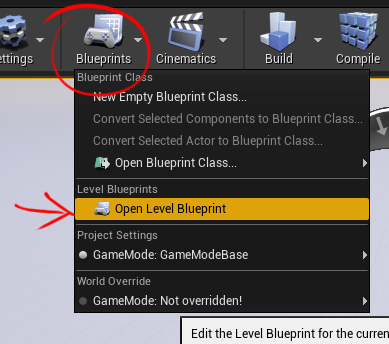
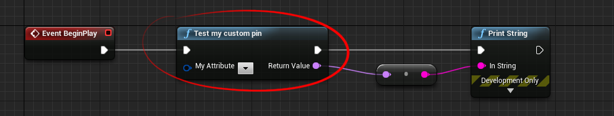
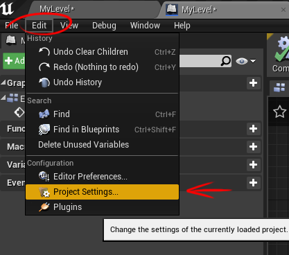
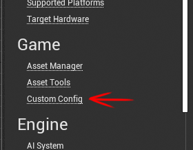
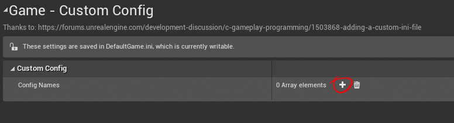
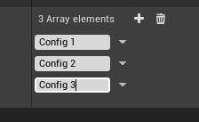
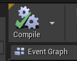
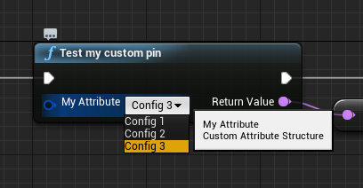
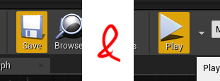
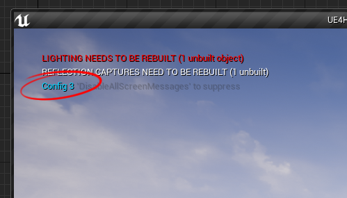

# How to - Create a custom Pin

This implementation has been inspired from the detailed post:  
[https://wiki.unrealengine.com/How_To_Create_Custom_Blueprint_Pin](https://wiki.unrealengine.com/How_To_Create_Custom_Blueprint_Pin).  

> /!\ When this repository has been created, the UE wiki has been removed from the Epic staff due to security problems.  
> Nonetheless they gave access of an archive with all the wiki contents.  
> Inside you can find the same article in the following path:  
> `WikiPages/Unreal%20Engine%20Wiki/mediawikiv2-website-prod05.ol.epicgames.net/index0275.html`

## Tables

* [Introduction](#title1)
    * [Goals](#title1-1)
    * [Repo contents](#title1-2)
    * [Forewords](#title1-3)
* [Let it works: step by Step guide](#title2)
    * [1 - open blueprint level](#title2-1)
    * [2 - locate the blueprint node](#title2-2)
    * [3 - open project settings](#title2-3)
    * [4 - open custom settings](#title2-4)
    * [5 - add new config name](#title2-5)
    * [6 - compile](#title2-6)
    * [7 - choose a config name in the blueprint](#title2-7)
    * [8 - save and play](#title2-8)
    * [9 - see your choosen config printed](#title2-9)
* [Implementation notes](#title3)
    * [UE4HowtoCustomPin.uproject](#title3-1)
    * [Main `Source` directory](#title3-2)
    * [`CustomPin` Plugin](#title3-3)
* [Next](#title4)
    

## Introduction
[^ tables](#tables)

### Goals
[^ tables](#tables)

It's a simple repository to show you how to:
* **create a new pin** for nodes in the editor graph
* make it works associated to **custom settings** data

### Repo contents
[^ tables](#tables)

This project is composed of:

* a simple UE4 **c++ blank project** ready to build and start
* a custom plugin to give also an example of plugin management, in it you will find:
    * a custom **pin** object
    * a **factory** to register this pin to the editor graph
    * a custom **struct** which can be used as any UPROPERTY or UFUNCTION parameters to display our new pin in blueprint nodes
    * a custom **config** object used to create new possibilities to our pin choices (configuration located in UE4 `project settings`)

### Forewords
[^ tables](#tables)

#### What motivates me

The [Unreal Engine](https://www.unrealengine.com/) is a really powerfull, modulable and adaptative tool :muscle:.  
Every time I need to create a new tool for my project, I know it's possible, which brings me a really confortable and confident state of mind :sunglasses: at first.  
Then I code a very specific feature and carryed by this state of mind, I try to make things a step behind the common way.
And despite the awesome community, tons of videos, free tutorials, forum and wiki with tons of good contents, I'm stuck :flushed:... cause I don't have a clue of how it can be made (=> missing documentation parts, outdated examples,...)...

Soooo frustrating!

Cause **I hate** :rage: to step backward to a simplest _"similar but not completely what I want"_ feature, **I dig** in the [engine code](https://github.com/EpicGames/UnrealEngine).  
What is really hard to me at first, is to get a glance of **where** I start to dig in :question::frowning::question:.  

#### My way of processing

The way **I love** :heart_eyes: to dig is to take a working sample of codes (working with a recent Engine version to avoid _"hard to understand"_ building errors...), make it work and try to move nearest to my needs.

Cause I'm guessing I'm processing the same as many of us, and cause of my _"it's best to have one frustrated than a thousand"_ thinking, I try to share what I've found to help the next _"stucking guy"_ to go faster :v: :gift:.  

It's **this** way of processing which inspired me to create a **repository** instead of a unreal forum's post:
1. you clone it
2. you try it
3. you trick it
5. you can use it for your project
6. and if you want to help too, you can pull requests to improve the code, add additionnal contents or keep it up to date with new engine versions

## Let it works: step by Step guide
[^ tables](#tables)

### 1 - open blueprint level
[^ tables](#tables)

Example is located in the blueprint level, so open it:

### 2 - locate the blueprint node
[^ tables](#tables)

Choices are empty for now, don't panic, somes are coming soon!

### 3 - open project settings
[^ tables](#tables)

### 4 - open custom settings
[^ tables](#tables)

### 5 - add new config name
[^ tables](#tables)

### 6 - compile
[^ tables](#tables)

### 7 - choose a config name in the blueprint
[^ tables](#tables)

### 8 - save and play
[^ tables](#tables)

### 9 - see your choosen config printed
[^ tables](#tables)

## Implementation notes
[^ tables](#tables)

I enjoined you to look at each classes to see implementations details, but before just a quick glance of what it is composed of:

### [UE4HowtoCustomPin.uproject](./UE4HowtoCustomPin.uproject)
[^ tables](#tables)

Not really interesting, just look at the `"plugins"` section which import the main plugin.

### Main `Source` directory
[^ tables](#tables)

Except the [`UE4HowtoCustomPin.Build.cs`](./Source/UE4HowtoCustomPin/UE4HowtoCustomPin.Build.cs) file to see dependencies, it don't worth it. I didn't do anything in it, it's all default contents created with Unreal Engine boilerplate.

### `CustomPin` Plugin
[^ tables](#tables)

All the job is done here!  
You can look at the [`CustomPin.Build.cs`](./Plugins/CustomPin/Source/CustomPin/CustomPin.Build.cs) to see dependencies.  
A quick preview of each classes:

| Class | files | Purpose |
| -- | -- | -- |
| `FCustomPinModule` | CustomPin[.h](./Plugins/CustomPin/Source/CustomPin/Public/CustomPin.h)/[.cpp](./Plugins/CustomPin/Source/CustomPin/Private/CustomPin.cpp) | Is the "bringer of life" of this project, when it starts it uses the factory to add our visual pin to the Editor Graph. |
| `FCustomPinFactory` | CustomPinFactory[.h](./Plugins/CustomPin/Source/CustomPin/Public/CustomPinFactory.h) | It checks for a given pin if it's associated to our Custom Attribute. |
| `FSimpleNameAttribute` | SimpleNameAttribute[.h](./Plugins/CustomPin/Source/CustomPin/Public/Attribute/SimpleNameAttribute.h) | This is a simple struct we want our pin will be associated to. |
| `UListNameConfig` | ListNameConfig[.h](./Plugins/CustomPin/Source/CustomPin/Public/Config/ListNameConfig.h) | Thank to this we can't create a simple `project settings` menu and data. |
| `UCustomPinBPLibrary` | CustomPinBPLibrary[.h](./Plugins/CustomPin/Source/CustomPin/Public/CustomPinBPLibrary.h)/[.cpp](./Plugins/CustomPin/Source/CustomPin/Private/CustomPinBPLibrary.cpp) | This will create a simple functionnal node which use our CustomAttribute as function's parameter. |
| `SListNameFromConfigPin` | ListNameFromConfigPin[.h](./Plugins/CustomPin/Source/CustomPin/Public/Pin/ListNameFromConfigPin.h)/[.cpp](./Plugins/CustomPin/Source/CustomPin/Private/ListNameFromConfigPin.cpp) | This is the pin object, it embeds all the behavior, user events, retrieving associated data and UI build. |

## Next
[^ tables](#tables)

I hope it helps you during your [Epic](https://www.epicgames.com/)'s journey!  
As I said in the [forewords](#title1-3), if you want to improve this, add contents or keep it up to date with new Unreal version you are very welcome!

I plan to make a serie of **UE4 HowTo** repositories like it, so keep in touch!

:wink: